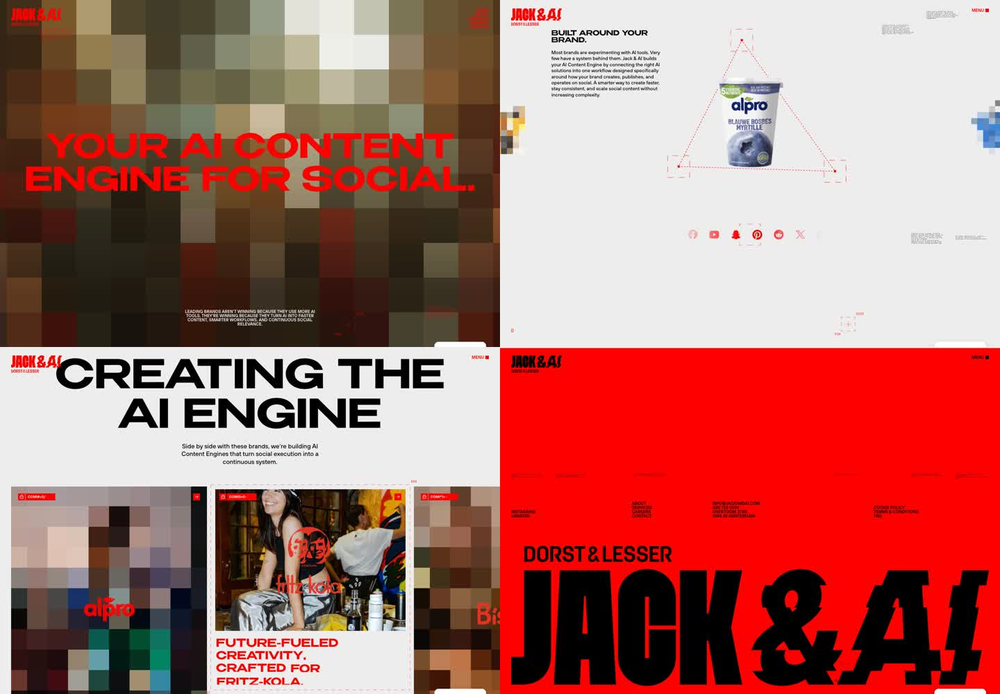
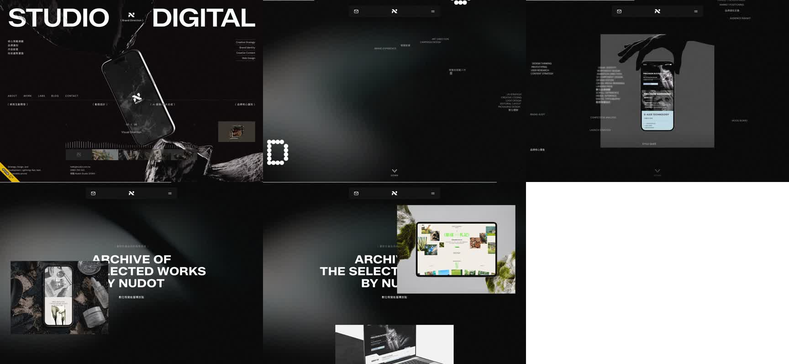
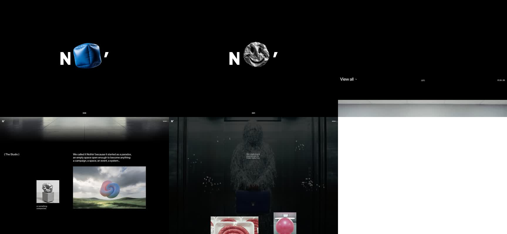
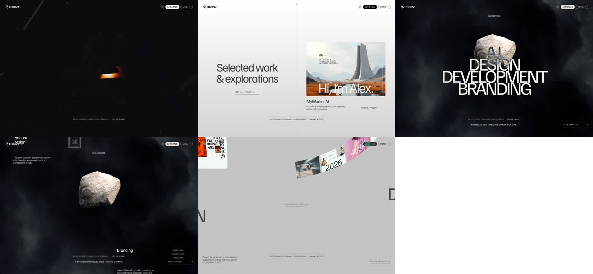

# Tigon reference and motion audit

Date: 2026-07-10
Status: durable review snapshot, not an implementation contract
Scope: Jack & AI, Nudot, Nothin', Trionn, current Tigon homepage and MadeWithGSAP motion references

## Current use — 2026-07-13

This file preserves reference observations only. It does not govern execution order, current layouts or asset inventory. Use `docs/current-homepage-state.md`, `docs/current-project-rules.md`, `docs/decision-log.md` and `docs/motion-and-assets-roadmap.md` for the active project state.

## Why this document exists

This captures the live reference review so the sites do not need to be re-audited before every motion decision.

The sites can change after this date. The screenshots and observations below describe the desktop versions inspected on 2026-07-10.

This document does not authorize copying external code, CSS, fonts, images, video or visual identity. External references are motion and composition architecture only.

## Method

- Live desktop inspection at 1440 × 1000.
- Multiple scroll positions captured per site.
- DOM, loaded scripts and asset requests inspected.
- Layout, section rhythm, palette, motion model and asset placement compared.
- Current Tigon page order and motion implementation checked against `docs/current-homepage-state.md` and `src/components/motion/HomeMotion.tsx`.
- Awwwards criteria checked against the official evaluation system.

Not covered:

- Full mobile audit of the external sites.
- Formal performance benchmark or Lighthouse comparison.
- Source-code reproduction of any external effect.
- Rights or licensing assessment of external assets.

## Captured reference sheets

### Jack & AI

File: `references/jackandai_journey-2026-07-10.jpg`

### Nudot

File: `references/nudot_journey-2026-07-10.jpg`

### Nothin'

File: `references/nothin_journey-2026-07-10.jpg`

### Trionn

File: `references/trionn_journey-2026-07-10.jpg`

## Executive conclusion

Tigon does not primarily need more animation. It needs one memorable motion idea that belongs to the content.

The current homepage already has:

- hero entrance
- scroll-filled approach copy
- one pinned `IDÉ / LØSNING` scene
- animated service accordion
- opposite-moving Overlevering tracks
- active-state Effekt sequence
- one-shot Work settling and mild image parallax
- Prosess title decode, token settling and line draw
- manifesto and footer reveals

Adding more independent reveals would make the page busier without making it more distinctive.

The strongest path is:

1. Make `04 / Arbeid` the single new showpiece.
2. Give `05 / Prosess` one content-led transformation after Work is approved.
3. Strengthen `03 / Effekt` only if the connection between the four outcomes is still unclear.
4. Keep Manifest and Contact quiet.
5. Do not add another pinned chapter.

## Live reference findings

### 1. Jack & AI

URL: https://jackandai.com/

#### Layout

- Full-screen chapters with a fixed global scroller.
- Very large typographic scenes followed by sparse editorial information.
- Work and brand material receive custom compositions rather than a repeated card layout.
- Strong jumps between immersive hero, light process content, project material and a red closing scene.

#### Colour

- Black, light grey/off-white and one dominant signal red.
- The palette is intentionally narrow; visual variation comes from scene structure and asset treatment.
- The red is brand identity, not a generic interaction accent.

#### Motion

- GSAP, ScrollTrigger and Lenis detected in loaded scripts.
- Body and HTML scrolling are hidden; a fixed Lenis container owns the experience.
- Nineteen canvas elements were active in the desktop pass.
- Pixelation, glitch, marquee movement and opposite-moving typography are repeated as a coherent identity system.
- Motion changes how assets are perceived; it is not limited to entrance reveals.

#### Assets

- Twenty-four image elements observed.
- Images load from `/wp-content/uploads/`.
- Brand photography, campaign material and logos are processed through canvas and pixel treatment.
- No ordinary HTML video element was present in the inspected state; canvas processing carries much of the visual motion.

#### Useful for Tigon

- One coordinated motion system per chapter.
- Readable foreground content can stay stable while decorative typography moves behind it.
- Asset processing can be part of the identity when used consistently.

#### Do not copy

- Global fixed-scroll architecture.
- Red palette.
- Glitch or pixelation as general decoration.
- Continuous movement across every chapter.

### 2. Nudot

URL: https://nudot.com.tw/

#### Layout

- Long dark technical journey with large spatial gaps.
- A stable work heading acts as an anchor while project assets change position and scale.
- Phone mockups, websites, video and project material are treated as objects inside a scene.
- Navigation and labels remain small while work assets carry the visual weight.

#### Colour

- Black and near-black dominate.
- White typography and grey light fields create depth.
- Project imagery introduces controlled colour.
- A light opening state and dark work state provide a strong chapter break.

#### Motion

- GSAP, ScrollTrigger, Lenis and Three.js detected.
- Four canvas elements and multiple sticky containers observed.
- Sticky ring/gallery structures, cursor tracking, parallax and WebGL/video treatments are used.
- Work motion is spatial: assets enter, rotate, overlap and leave around a stable typographic anchor.

#### Assets

- Thirty-two image elements observed.
- Ten video elements were present in the inspected DOM state.
- Main material loads from `/images/home/`, including project videos, a star video and phone/site mockups.
- Navigation has a separate `/images/nav/` asset group.

#### Useful for Tigon

- Keep one stable Work heading while assets perform the scene change.
- Use actual work assets as the colour moment.
- Create depth with light, scale and spacing before adding more UI.

#### Do not copy

- WebGL without an authored Tigon asset idea.
- Sticky gallery as default work navigation.
- Cursor tracking on touch or as a replacement for clear structure.

### 3. Nothin'

URL: https://www.noth.in/

#### Layout

- Very large black fields with isolated objects and short statements.
- Work, studio, manifesto and people chapters have clearly different density and composition.
- Small objects gain importance because the surrounding interface is restrained.
- Project sections use uneven image sizes and offsets instead of a regular portfolio grid.

#### Colour

- Interface is almost entirely black and white.
- Saturated blue, pink and metallic tones belong to bespoke objects and film.
- Colour is carried by assets, not buttons or decorative UI.

#### Motion

- GSAP, ScrollTrigger, Lenis and Three.js detected in loaded scripts.
- No canvas element was present in the inspected DOM state.
- Four video elements, sticky words, image parallax and transform-driven work scenes were observed.
- The page uses tactile materials and film to create depth rather than glassmorphism.

#### Assets

- Twenty-nine image elements observed.
- Images load mainly from the Webflow CDN.
- Four long-form MP4 assets load from `noth-in.b-cdn.net`.
- Asset language includes crumpled foil, inflatables, plastic, candy and material close-ups.

#### Useful for Tigon

- Let Work assets own the colour while the interface stays near-monochrome.
- One authored asset family can create more identity than several generic effects.
- Empty space can be an active part of the choreography.

#### Do not copy

- Playful material objects without a Tigon-specific concept.
- Heavy video dependency before mobile and performance budgets are defined.
- Random object movement disconnected from the service story.

### 4. Trionn

URL: https://trionn.com/

#### Layout

- Dark smoky hero and service scenes alternate with hard white work and information chapters.
- Large grotesk statements are paired with editorial serif and small mono details.
- One recurring stone/object motif gives the page a recognisable visual spine.
- Work, services, testimonials and awards each have separate asset systems.

#### Colour

- Near-black and smoke dominate the cinematic scenes.
- Bright white chapters provide abrupt tonal reset.
- Project images and video supply local colour.
- Interface colour remains secondary to atmosphere and assets.

#### Motion

- GSAP, ScrollTrigger, Lenis, Three.js and Swiper detected.
- One canvas and six video elements were observed.
- The stone/object treatment uses a long image-frame sequence.
- Services, project material and page transitions use different mechanics but share one atmospheric system.

#### Assets

- Thirty image elements were present in the inspected DOM state.
- Project material loads from `/images/projects/`.
- A large sequence loads from `/images/stone/frame_####.webp`.
- Desktop/mobile videos load from `/video/`, including service, team and award material.

#### Useful for Tigon

- A signature effect should be tied to a recurring motif or content idea.
- A hard dark/light break can create more impact than another pinned timeline.
- Separate asset families make sections feel authored rather than templated.

#### Do not copy

- 3D or frame sequences before Tigon has a motif worth animating.
- Award badges or proof without equivalent real evidence.
- Cinematic smoke as a generic premium effect.

## What the reference set says as a whole

The strongest sites share five traits:

1. Motion is designed around assets, not added after the layout.
2. Each major chapter has a different role and density.
3. The interface palette stays narrow; assets provide local colour.
4. One recurring mechanism or motif creates identity.
5. Quiet chapters make showpiece chapters feel stronger.

They do not become distinctive by applying the same reveal to every heading.

## Current Tigon position

### What is already strong

- Hero scale and composition.
- Large `BYGGER` statement.
- `IDÉ / LØSNING` as the one pinned scene.
- Overlevering as a non-pinned typographic handoff.
- Clear near-monochrome palette with pine reserved for micro-signals.
- Server-rendered important text and links.
- Mobile and reduced-motion fallbacks.
- Quiet Manifest and Contact ending.

### Current asset position

Tigon currently has:

- sixteen files in `public/work/mockups/`
- seven files in `public/work/carousel/`
- five files in `public/services/`
- six selected images mounted in `WorkProof`
- paired mockup assets mounted in the service accordion

The six active Work images form a coherent editorial colour family, but they do not yet clearly demonstrate digital capabilities. They read primarily as photography.

For an Awwwards-level result, the final Work asset pass should provide an authored family of real interface surfaces, systems, product fragments or short loops. These must show what Tigon can create without pretending to be delivered client cases.

## Awwwards implication

Official weighting inspected on 2026-07-10:

- Design: 40%
- Usability: 30%
- Creativity: 20%
- Content: 10%

Design and usability therefore account for 70%. Motion that reduces clarity, control, mobile stability or loading performance can lose more than it gains.

The goal is not maximum animation. The goal is one original idea executed with strong design, readable content and reliable interaction.

## Recommended motion concepts

### Local source packages and implementation status — 2026-07-10

The user supplied the original effect packages and explicitly approved all four adaptations in the same design pass. Asset replacement is a later phase and is not a blocker for this implementation.

- `/Users/reezy/Downloads/mwg_016.zip`
- `/Users/reezy/Downloads/mwg_067.zip`
- `/Users/reezy/Downloads/mwg_097 (1).zip`
- `/Users/reezy/Downloads/mwg_105 (1).zip`

The HTML, CSS and JavaScript inside each archive were inspected. Nothing from the packages was imported into the Tigon bundle: no CSS, JS, fonts, Lenis setup or media assets.

Adapted mechanics:

- 016 → equal angle distribution, coordinated stagger and one group landing for Work; the original 500vh pin and orbit are omitted.
- 067 → 3D `rotateX` character treatment with random stagger, combined with the approved spatial `Uklart inn.` fragmentation; the original pin is omitted.
- 097 → real SplitText word measurement and free-space distribution before words gather into Effekt's existing metadata columns.
- 105 → active media field `scale: 1.1 → 1` with `back.out(2)` plus local service preview switching; the original fixed media layer and viewport-following list are omitted.

Current implementation status: all four are implemented as section-scoped progressive enhancement in `HomeMotion.tsx`, with no new pin.

### A. Work — coordinated capability constellation

Priority: highest
Reference principle: MadeWithGSAP 016
URL: https://madewithgsap.com/effects/effect016

Replace the six unrelated item-rise animations with one coordinated opening choreography:

- Work title remains stable.
- The six existing assets enter as one compact, asymmetric constellation.
- They separate and land directly in their final normal-flow positions.
- No orbit, active card state or mouse chasing.
- No pin.
- After landing, the section behaves like ordinary readable content.
- Mobile uses the final stacked layout with a short stagger or no motion.

Why this fits:

- It makes Work the memorable chapter.
- It uses assets already connected to the section.
- It does not repeat the pinned approach scene.
- It preserves the active normal-flow Work decision.

### B. Process — spatial `Uklart → System` transformation

Priority: second, only after Work is accepted
Reference principle: MadeWithGSAP 067
URL: https://madewithgsap.com/effects/effect067

Replace the random ASCII scramble with a content-led transformation:

- `Uklart inn.` begins readable.
- Its characters temporarily lose baseline and move toward the three process columns.
- Retning, Bygg and Live receive the fragments.
- `System ut.` resolves sharply on the grid.
- The process rail draws only after the title resolves.
- One-shot, transform-only and no pin.

Why this fits:

- The motion shows the meaning of the process.
- It is more specific than a generic decode effect.
- It gives Process a unique mechanic without making it harder to read.

### C. Effekt — continuous signal through four outcomes

Priority: third
Reference principle: MadeWithGSAP 097
URL: https://madewithgsap.com/effects/effect097

Possible refinement:

- Keep all four words and descriptions in normal document flow.
- A thin pine signal travels through the section.
- Each outcome becomes fully contrasted when crossed by the signal.
- Existing signal/tools text gathers into its final metadata position.
- The same line continues physically to the next outcome.

Why this fits:

- It turns four states into one causal journey.
- It uses existing content and does not require decorative imagery.

Do not implement this until Work has been reviewed. The page should not receive three new motion systems at once.

### D. Services — local focus preview

Priority: optional polish
Reference principle: MadeWithGSAP 105
URL: https://madewithgsap.com/effects/effect105

Possible refinement:

- The active accordion row composes its existing image pair into one main and one detail surface.
- The transition is local to the open row.
- Hover/focus and touch share the same active state.
- No sticky service stage and no cursor-following media.

This is useful polish, but it is not the path to a memorable homepage by itself.

## What not to add

- Another pinned section.
- Global scroll hijacking.
- Receding or stacked cards.
- Orbital Work navigation.
- Infinite marquees as filler.
- Glitch on unrelated headings.
- WebGL or 3D without a Tigon-specific asset idea.
- Continuous blur or filter animation.
- A new large signal colour.
- Additional motion in Manifest or Contact.

## The path forward

### Step 1 — make one decision

Decision: `04 / Arbeid` is the only next showpiece candidate.

Do not redesign three sections in parallel. Do not add a new main section.

### Step 2 — create one isolated Work prototype

Scope:

- `WorkProof` markup only if necessary.
- `work-proof.css`.
- the `workProof()` function in `HomeMotion.tsx`.
- no Header, Hero, SEO, footer, service or process edits.
- no pin.
- no external assets or MadeWithGSAP code imported.

Prototype goal:

- prove that the six assets can behave as one authored composition
- retain readable normal flow after the opening movement
- keep mobile and reduced-motion simple

### Step 3 — review before continuing

Go criteria:

- Work is clearly the page's memorable visual chapter.
- Every capability remains understandable without waiting for scroll state.
- Motion feels controlled at both fast and slow scrolling.
- Mobile has no jump, overlap or hidden content.
- The section still works with JavaScript disabled and reduced motion enabled.

Stop criteria:

- It starts to resemble the rejected orbital/pinned concept.
- Images move faster than the user can understand the content.
- The composition depends on cursor position.
- The current photography cannot communicate capability convincingly.
- The effect makes the section feel like a portfolio grid.

If stopped because of the assets, pause motion and complete the real Work asset pass first.

### Step 4 — only then evaluate Process

If the Work prototype succeeds, build the spatial `Uklart → System` title transformation as a separate, narrow pass.

Do not change Effekt in the same pass.

### Step 5 — final rhythm audit

After Work and Process are stable, review the full journey once:

- motion density
- dark/light rhythm
- scroll length
- mobile behaviour
- reduced motion
- performance
- whether Effekt still needs the signal refinement

This is the point where the page should be judged as a whole rather than continuing to add effects section by section.

## Current recommendation

Next implementation task, if approved:

> Build a narrow, reversible WorkProof motion prototype based on coordinated asset assembly. Preserve normal flow, use the existing six images, add no pin, and touch no other section.

No other motion implementation should begin before that prototype has been reviewed.
